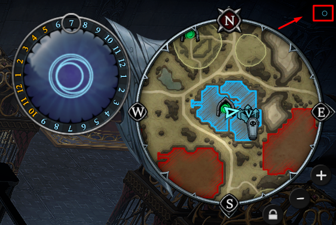

# Boss Respawn Overlay

Documentacao tecnica e tutorial do addon client-side para V Rising / Sangria Falls.

## 1. Visao geral

O Boss Respawn Overlay e um plugin separado do `SangrisInterface.dll`. Ele consulta internamente o comando:

```text
.boss tempo <boss>
```

Depois de receber a resposta, o overlay mantem um cronometro local regressivo e atualiza os bosses periodicamente. As respostas geradas pelas consultas automaticas sao consumidas internamente para nao poluir o chat. Se o jogador enviar `.boss tempo ...` manualmente, a consulta automatica em andamento e cancelada para preservar a mensagem manual.

Estado atual:

- versao: `0.4.6`;
- BepInEx Unity IL2CPP para V Rising;
- GUID: `sangriafalls.vrising.bossrespawnoverlay`;
- dependencia obrigatoria: `SangrisInterface.dll`;
- lista padrao: 61 bosses;
- configuracao persistente em `BepInEx/config/sangriafalls.vrising.bossrespawnoverlay.cfg`.

## 2. Instalacao

Feche o jogo antes de trocar DLLs. Na pasta do jogo, deixe:

```text
VRising/
└── BepInEx/
    └── plugins/
        ├── BossRespawnOverlay.dll
        └── SangrisInterface.dll
```

O BepInEx pode procurar DLLs tambem em subpastas de `plugins`. Para evitar carregar builds duplicadas, mantenha o projeto-fonte fora de `BepInEx/plugins` e deixe ali apenas a DLL final de cada plugin.

Dependencias necessarias:

1. V Rising com BepInEx Unity IL2CPP funcionando.
2. `SangrisInterface.dll` compativel na mesma pasta.
3. `BossRespawnOverlay.dll` na pasta `BepInEx/plugins`.

## 3. Tutorial da interface

### 3.1 Abrir a overlay

O painel comeca minimizado. O ponto circular destacado no canto superior direito abre e fecha a interface:



Clique no ponto para mostrar o painel.

O pequeno botao de porcentagem logo abaixo do ponto alterna a escala visual entre `60%`, `75%`, `85%`, `100%`, `115%`, `125%`, `150%` e `175%`. Use uma escala menor em 1080p e uma maior em monitores 4K. A escolha fica salva em `UiScale`.

### 3.2 Mover a overlay

Com o painel aberto, clique e arraste o cabecalho `Bosses (arraste o cabecalho)` para a posicao desejada. A posicao fica salva no arquivo de configuracao.

### 3.3 Atos

Os quatro grupos comecam fechados. Clique no cabecalho de um ato para expandir ou recolher sua lista. O estado dos atos abertos fica salvo em `ExpandedActs`.

### 3.4 Preferenciais

Clique em `Fixar` ao lado de um boss para coloca-lo na secao `Preferenciais`, no topo do painel. O botao muda para `Topo` enquanto ele estiver fixado.

Os preferenciais ficam salvos em `PinnedBosses` e continuam entre sessoes. A lista normal nao repete os bosses fixados.

### 3.5 Botao Morto

Clique em `Morto` depois de matar um boss. O overlay marca o boss como morto, zera o contador visual e coloca uma consulta prioritaria na fila. Essa consulta comeca aproximadamente 0,1 segundo depois do clique.

### 3.6 Cores e estados

- verde: resposta recebida e boss vivo;
- vermelho: resposta recebida e boss morto, com tempo de respawn ou resposta de boss nao encontrado;
- cinza: ainda aguardando a primeira resposta;
- `Morto`: inicia uma consulta manual prioritaria;
- `Topo`: boss esta nos preferenciais.

## 4. Lista completa por ato

A divisao usa os niveis informados para o projeto:

- Ato 1: niveis 30 a 47;
- Ato 2: niveis 50 a 68;
- Ato 3: niveis 70 a 75;
- Ato 4: niveis 76 ou maiores.

### Ato 1 — niveis 30–47 (12 bosses)

| Boss | Nivel | Comando consultado |
|---|---:|---|
| Keely | 30 | `keely` |
| Errol | 30 | `errol` |
| Rufus | 30 | `rufus` |
| Grayson | 37 | `grayson` |
| Goreswine | 37 | `goreswine` |
| Lidia | 40 | `lidia` |
| Clive | 40 | `clive` |
| Finn | 42 | `finn` |
| Polora | 45 | `polora` |
| Kodia | 45 | `kodia` |
| Nicolau | 45 | `nicolau` |
| Quincey | 47 | `quincey` |

### Ato 2 — niveis 50–68 (19 bosses)

| Boss | Nivel | Comando consultado |
|---|---:|---|
| Beatrice | 50 | `beatrice` |
| Vincent | 54 | `vincent` |
| Christina | 54 | `christina` |
| Tristan | 54 | `tristan` |
| Erwin | 56 | `erwin` |
| Kriig | 57 | `kriig` |
| Leandra | 57 | `leandra` |
| Maja | 57 | `maja` |
| Bane | 60 | `bane` |
| Grethel | 60 | `grethel` |
| Meredith | 60 | `meredith` |
| Terah | 63 | `terah` |
| Frostmaw | 63 | `frostmaw` |
| Elena | 63 | `elena` |
| Gaius | 65 | `gaius` |
| Cassius | 67 | `cassius` |
| Jade | 67 | `jade` |
| Raziel | 67 | `raziel` |
| Octavian | 68 | `octavian` |

### Ato 3 — niveis 70–75 (9 bosses)

| Boss | Nivel | Comando consultado |
|---|---:|---|
| Ziva | 70 | `ziva` |
| Domina | 70 | `domina` |
| Angram | 71 | `angram` |
| Ungora | 73 | `ungora` |
| Ben | 73 | `ben` |
| Foulrot | 73 | `foulrot` |
| Albert | 74 | `albert` |
| Willfred | 74 | `willfred` |
| Cyril | 75 | `cyril` |

### Ato 4 — niveis 76+ (21 bosses)

| Boss | Nivel | Comando consultado |
|---|---:|---|
| Magnus | 76 | `magnus` |
| Barão | 80 | `barão` |
| Morian | 80 | `morian` |
| Mairwyn | 80 | `mairwyn` |
| Henry | 84 | `henry` |
| Jakira | 85 | `jakira` |
| Stavros | 85 | `stavros` |
| Lucile | 86 | `lucile` |
| Matka | 86 | `matka` |
| Terrorclaw | 86 | `terrorclaw` |
| Azariel | 89 | `azariel` |
| Voltatia | 89 | `voltatia` |
| Simon | 90 | `simon` |
| Dantos | 92 | `dantos` |
| Styx | 94 | `styx` |
| Gorecrusher | 94 | `gorecrusher` |
| Valencia | 94 | `valencia` |
| Solarus | 96 | `solarus` |
| Talzur | 96 | `talzur` |
| Megara | 98 | `megara` |
| Adam | 98 | `adam` |

### Nomes especiais

- `Willfred` tem dois `l` e o comando e `willfred`.
- `Barão` usa o comando `barão`. A grafia antiga `bar~ao` e corrigida durante a migracao da configuracao.
- O nivel serve apenas para ordenar e dividir os atos; ele nao e enviado no comando.

## 5. Polling e cronometro

O intervalo normal entre consultas e de aproximadamente 1 segundo. Cada consulta espera uma resposta ou um timeout de ate 12 segundos antes de liberar a proxima.

Sem preferenciais, a fila percorre os bosses normais na ordem configurada:

```text
Boss 1 -> Boss 2 -> Boss 3 -> ... -> ultimo boss -> Boss 1
```

Com preferenciais, a fila alterna os dois grupos:

```text
Preferencial 1 -> Normal 1 -> Preferencial 2 -> Normal 2 -> Preferencial 3 -> Normal 3
```

O cronometro local diminui continuamente enquanto o boss esta morto. Uma nova resposta do servidor corrige o valor e define novamente o estado vivo/morto.

O campo `PollIntervalSeconds` foi mantido por compatibilidade com configuracoes antigas, mas a cadencia atual usa o intervalo fixo de aproximadamente 1 segundo entre consultas.

## 6. Configuracao

Arquivo:

```text
VRising/BepInEx/config/sangriafalls.vrising.bossrespawnoverlay.cfg
```

| Secao | Chave | Funcao |
|---|---|---|
| General | `Enabled` | Liga ou desliga o overlay. |
| General | `InitialDelaySeconds` | Atraso antes da primeira consulta depois de entrar no mundo. |
| General | `PollIntervalSeconds` | Campo legado; nao controla a cadencia atual. |
| Boss | `Bosses` | Lista de comandos, separados por virgula, na ordem da fila normal. |
| Boss | `PinnedBosses` | Comandos dos preferenciais persistentes. |
| UI | `ExpandedActs` | Atos abertos, por exemplo `1,3`. |
| UI | `PanelWidth` | Largura do painel. |
| UI | `PanelHeight` | Altura do painel e area de rolagem. |
| UI | `UiScale` | Escala visual entre `0.60` e `1.75`; tambem pode ser alterada pelo botao discreto. |
| UI | `PositionX` / `PositionY` | Posicao salva do painel. |
| UI | `FontSize` | Tamanho da fonte. |

## 7. Diagnostico

Se o painel nao aparecer:

1. Confirme que o jogo esta iniciando com BepInEx.
2. Confirme que `SangrisInterface.dll` esta em `BepInEx/plugins`.
3. Confirme que existe apenas uma DLL final do overlay no diretorio de plugins.
4. Reinicie o jogo depois de trocar a DLL.
5. Consulte `BepInEx/LogOutput.log` e procure por `Boss Respawn Overlay`.

Mensagens uteis no log incluem a quantidade de bosses carregada, a lista de comandos e o resultado das consultas. Um boss desconhecido normalmente indica grafia diferente do nome utilizado pelo servidor.

Comandos manuais continuam sendo permitidos. Ao detectar que o jogador digitou `.boss tempo`, o addon cancela a consulta automatica em andamento e nao destroi a resposta manual.

## 8. Compilacao e deploy

Requisitos:

- .NET SDK 6;
- instalacao local do V Rising;
- BepInEx IL2CPP e `SangrisInterface.dll` instalados.

O projeto esta fora da pasta do jogo e usa `VRisingDir` para localizar as referencias:

```powershell
dotnet build .\BossRespawnOverlay.csproj -c Release `
  -p:VRisingDir="C:\Program Files (x86)\Steam\steamapps\common\VRising" `
  -p:DeployPlugin=false
```

O build gera a DLL em `bin/Release` e nao instala nada por padrao. Para copiar a DLL diretamente para `BepInEx/plugins`, use:

```powershell
dotnet build .\BossRespawnOverlay.csproj -c Release `
  -p:VRisingDir="C:\Program Files (x86)\Steam\steamapps\common\VRising" `
  -p:DeployPlugin=true
```

O site estatico da Vercel usa o `index.html` da raiz e disponibiliza `BossRespawnOverlay.dll` como download. Depois de uma nova build publica, substitua a DLL da raiz e atualize o SHA-256 exibido na pagina.

## 9. Verificacao de seguranca

Antes de instalar uma DLL recebida de outra pessoa:

1. Baixe o arquivo somente de uma fonte confiavel.
2. Abra o [VirusTotal](https://www.virustotal.com/gui/home/upload).
3. Envie `BossRespawnOverlay.dll`.
4. Compare o SHA-256 informado na pagina de download com o valor exibido na aba de detalhes.

Um alerta isolado pode ser falso positivo em mods, mas varias deteccoes devem ser tratadas com cautela. O VirusTotal nao e uma garantia absoluta.

## 10. Arquitetura atual

O plugin possui quatro responsabilidades principais:

1. `BossDefinition` mantem nome exibido, nivel e nome usado no comando.
2. `BossRespawnOverlayBehaviour` controla estado, polling, respostas, cronometros e interface.
3. `ClientChatPatch` conecta o comportamento ao mundo do cliente e ao sistema de chat.
4. A configuracao do BepInEx persiste preferenciais, atos abertos, posicao e parametros visuais.

O transporte atual envia o comando pelo evento interno de chat do cliente. As respostas sao identificadas pelo boss consultado e consumidas apenas quando correspondem a uma requisicao automatica ativa.

## 11. Limites conhecidos

- O addon depende da API e dos tipos IL2CPP da versao instalada do V Rising.
- Uma atualizacao do jogo ou do SangrisInterface pode exigir recompilacao.
- O cronometro e uma estimativa local entre respostas do servidor; ele nao substitui uma nova consulta.
- Preferenciais e atos abertos sao configuracoes locais e nao acompanham a DLL.

## 12. Estado do projeto

Esta e a versao estavel `0.4.6` do Boss Respawn Overlay. O site, a DLL publica e esta documentacao devem permanecer alinhados com a mesma versao.
